# 绪论

## 一、概念和术语

1. 数据

   数据是描述客观事务的符号，是计算机中可以操作的对象

2. 数据元素（具体的某个人，比如小明）

   数据元素是组成数据的，有一定意义的基本单位。也被称为记录

3. 数据项（比如人的姓名，年龄）

   数据项是数据不可分割的最小单位（数据元素的属性）

4. 数据对象（比如人类）

   数据对象是性质相同（属性相同）的数据元素的集合，是数据的子集

5. 数据结构

   是相互之间存在的一种或多种特定关系的数据元素的集合

   

## 二、逻辑结构和物理结构

### 逻辑结构

- 数据对象中数据元素之间的相互关系

1. 集合结构

   集合结构中的数据元素除了同属于属于一个集合外，它们之间没有其他关系。类似数学中的集合

2. 线性结构

   线性结构中的数据元素的一对一的关系

   

3. 树形结构

   数据元素之间存在一对多的层次关系

   

4. 图形结构

   数据元素之间存在多对多的层次关系

   

### 物理结构

- 数据的逻辑结构在计算机中存储的形式

1. 顺序存储结构

   把数据元素放在地址连续的存储单元里，其数据间的逻辑关系和物理关系一致

   

2. 链式存储结构

   把数据元素放在任意的存储单元里，可以不连续，用指针来找下一个的地址

   

## 三、抽象数据类型

1. 数据类型（例如int，string）

   一组性质相同的值的集合+定义在这个集合上的一些操作

2. 抽象数据类型

   抽象体现在没有具体实现，例如数据类型为int，抽象数据类型为整数

PS:引用是取别名，意味着两个变量共享一处地址。在算法中用引用来表示输出型参数，不论这个参数是否发生改变


# 线性表

## 一、定义

​     	 线性表是一个具有相同特性的数据元素的有限序列

- 相同特性：所有元素属于同一数据类型
- 序列：数据元素由逻辑序号唯一确定，一个线性表中可以由相同值的元素

## 顺序存储结构

​         顺序表和线性表的区别：顺序表是物理结构，线性表是逻辑结构


### 算法实现

​	顺序表

1. 类型定义

   

2. 创建顺序表

   ```c
   void CreateList(SqList *&L,ElemType a[],int n){
       int i;
       L=(SqList *)malloc(sizeof(SqList));
       for(i=0;i<n;i++)
           L->data[i]=data[i];
       L->length=n;
   }
   ```

###      线性表基本运算

1. 初始化线性表

   ```c
   void InitList(SqList *&L){
       L=(SqList *)malloc(sizeof(SqList));
       L->length=0;
   }
   ```

2. 销毁线性表

   ```c
   void DeList(SqList *&L){
       L=(SqList *)malloc(sizeof(SqList));
       L->length=0;
   }
   ```

3. 判断是否为空表

   ```c
   bool isEmpty(SqList *L){
   	if(L->length==0){
           return 1;
       }else{
           return 0;
       }
   }
   ```

4. 求线性表的长度

   ```c
   int ListLength(SqList *L){
       return (L->length);
   }
   ```

5. 输出线性表

   ```c
   void DispList(SqList *L){
       int i;
       if(L->length==0)
           return;
       for(i=0;i>(L->length);i++){
           printf("%c",L->data[i]);
       }
       printf("\n");
   }
   ```

   

6. 求某个数据元素值

   ```C
   bool GetElem(SqList *L,int i,ElemType &e){
       if(i<1||i>L->length) return false;
        e=L->data[i-1];
       return true;
   }
   ```

   

7. 按元素值查找

   ```c
   int GetByValue(SqList *L,ElemType e){
       int i=0;
       whlie(i<L->length&&L->data[i]!=e)
           i++;
       if(i>=L->length) return 0;
       else return 1;
   }
   ```

8. 插入数据元素

   ```c
   bool ListInsert(SqList &*L,ElemType e,int i){
       int j;
       if(i<1||i>L->length+1){
           return false;
       }
       i--;
       for(j=L->length;j>i;j--){
           L->data[j]= L->data[j-1];
       }
       L->data[i]=e;
       L->length++;
       return true;
   }
   ```

   

9. 删除数据元素

   ```c
   bool ListDelete(SqList &*L,ElemType e,int i){
       int j;
       if(i<1||i>L->length){
           return false;
       }
       i--;
       for(j=i;j<L->length-1;j++)
           L->data[j]=L->data[j+1];
       L->length--;
       return true;
   ```

## 链式存储结构

一、链表

​		线性表中每个结点有唯一的前驱结点和后驱结点（每个结点增加一个指向后继结点的指针域——单链表；每个结点增加一个指向后继结点的指针域和一个指向前继结点的指针域——双链表）


​	   带头结点的单链表的优点：

- 第一个结点的操作和其他结点一致
- 把空表和非空表的处理统一起来了

​       存储密度：

​				结点中数据部分的存储空间/结点存储总空间

### 单链表

（无法访问前一个结点）

```c
typedef struct LNode{
    ElemType data;
    struct LNode *next;//指向下一个结点
} LinkList;
```

1. 插入结点

   

2. 删除结点

   

3.  头插法建表（先建一个头结点，把新结点插入到当前链表的表头上。这样的话链表的物理顺序和逻辑顺序相反)

   ```c
   void CreateListF(LinkList *&L,ElemType a[],int n){
       LinkList *s;
       int i;
       L=(LinkList)malloc(sizeof(LinkList)); //创建头结点
       L->next=NULL;
       for(i=0;i<n;i++){
           s=(LinkList *)malloc(sizeof(LinkList));
           // 创建新结点
           s->data[i]=a[i];
           s->next = L->next;
           L->next=s;
       }  
   }
   ```

4. 尾插法建表（增加一个尾指针始终指向当前链表的尾结点，将新结点插入到当前链表的尾部）

   ```c
   void CreateLisR(LinkList *&L,ElemType a[],int n){
       LinkList *s,*r;
       int i;
       L=(LinkList)malloc(sizeof(LinkList)); //创建头结点
       L->next=NULL;
       r=L;						//尾结点开始时指向头结点
       for(i=0;i<n;i++){
           s=(LinkList *)malloc(sizeof(LinkList));
           // 创建新结点
           s->data=a[i];
           r->next=s;
           r=s;
       }  
       r->next= NULL;
   }
   ```


#### 线性表基本运算

1. 初始化线性表

   ```c
   void InitList(LinkList *&L){
       L=(LinkList *)malloc(sizeof(LinkList));
       L->next=NULL;
   }
   ```

2. 销毁线性表

   ```c
   void DestroyList(LinkList *&L){
       LinkList *pre=L,*p = L->next;
       while(p!=NULL){
           free(pre);
           pre=p;
           p=pre->next; 
       }
       free(pre);
   }
   ```

   

3. 判断线性表是否为空

   ```c
   book IsEmpty(LinkList *L){
       return(L->next==NULL);
   }
   ```

   

4. 求线性表长度

   ```c
   int ListLength(LinkList *L){
       int i=0;
       LinkList *p=L;
       while(p->next!=NULL){
           i++;
           p=p->next;
       }
       return i;
   }
   ```

5. 输出线性表

   ```c
   void DisList(LinkList *L){
       LinkList *p=L->next;
       if(p!=NULL){
           printf("%d",p->data);
           p=p->next;
       }
       printf("\n");
   }
   ```

   

6. 求线性表中某一位置的元素

   ```c
   bool FindElem(LinkList *L,int i,ElemType &e){
       int j=0;
       LinkList *p=L;
       while(j<i&&p!=NULL){
           j++;
           p=p->next;
       }
       if(p==NULL)
           return false;
       else
           e=p->data;
       return true;
   }
   ```

   

7. 求线性表中某一值的元素的所在位置

   ```c
   int LocateElem(LinkList *L,ElemType e){
       int i=1;
       LinkList *p=L->next;
       while(p!=NULL&&p->data!=e){
           p=p->next;
           i++;
       }
       if(p==NULL){
           return -1;
       }else{
           return i;
       }
   }
   ```

   

8. 插入数据元素

   ```c
   bool InsertList(LinkList *&L,int i,Elemtype e){
       int j=0;
       LinkList *p=L,*s;
       while(j<i-1&&p!=NULL){
           p=p->next;
           j++;
       }
       if(p==NULL)
           return false;
       else{
           s=(LinkList *)malloc(sizeof(LinkList));
           s->data=e;
           s->next=p->next;
           p->next=s;
           return true;
       }
   }
   ```

   

9. 删除数据元素

   ```c
   bool DelElem(LinkList *&L,int i，Elemtype &e){
       int j=0;
       LinkList *p=L,*s;
       while(j<i-1&&p!=NULL){
           j++;
           p=p->next;
       }
       if(p==NUll){
           return false;
       }else{
           q=p->next;
           if(q==NULL){
               return false;
           }
           e=q->data;
           p->next=q->next;
           free(q);
           return true;
       }
   }
   ```

10. 使单链表递增排序 ***

    ```c
    void sort(LinkList *&L){
        LinkList *p,*pre,*q;
        p=L->next->next;
        L->next->next=NULL;
        while(p!=NULL){
            q=p->next;
            pre=L;
            if(pre->next!=NULL&&pre->next->data<p->data)
                pre=pre->next;
            p->next=pre->next;
            pre->next=p;
            p=q;
        }
    }
    ```

11. 单链表倒序（采用头插法）

    ```c
    void Reverse(LinkList *&L){
        LinkList *p=L->next , *q;
        L->next=NULL;
        while(p!=NULL){
            q=p->next;
            p->next=L->next;
            L->next=p;
            p=q
        }
    }
    ```

12. 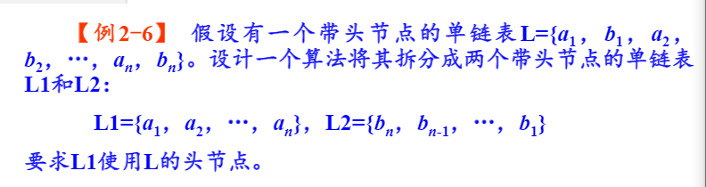

    

    ```c
    void split(LinkList *&L,LinkList *&L1,LinkList *&L2){
        LinkList *p=L->next, *r1, *q;
        L1=L;
        r1=L1;
        L2=(LinkList *)malloc(sizeof(LinkList));
        L2->next=NULL;
        while(p!=NULL){
            //尾插法
            r1->next=p;
            r1=p;
            p=p->next;
            //头插法
            q=p->next;
            p->next=L2->next;
            L2->next=p;
            p=q;
        }
        r1->next=NULL;
    
    }
    ```

**荷兰国旗问题**

用顺序表存储  

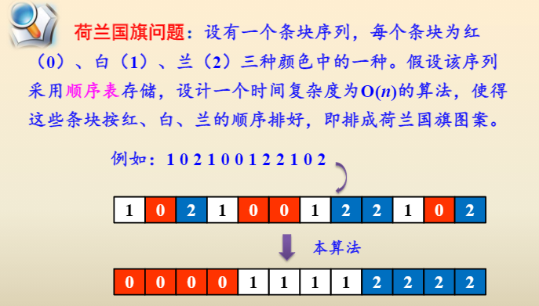

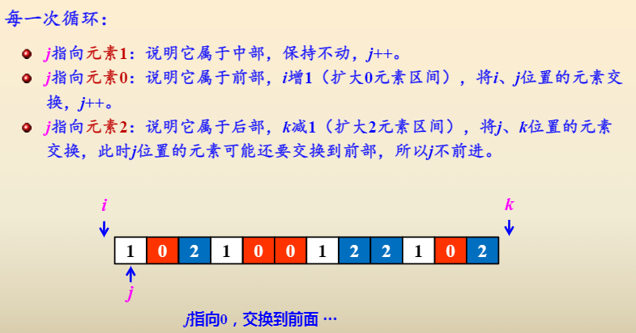

```c
void flag(SqList *&L){
    int i=-1,j=0,k=L->length;
    while(j<k){
        if(L->data[j]==0){
            i++;
            swap(L->data[i],L->data[j]);
            j++;
        }
        else if(L->data[j]==2){
            k--;
            swap(L->data[k],L->data[j])
        }
        else{
            j++;
        }
    }
}
```

链表存储

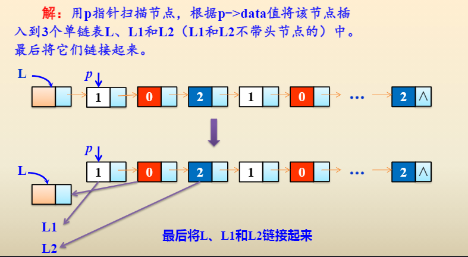

```c
void flag(LinkList *&L){
    LinkList *p,*L1,*L2,*r,*r1,*r2;
    L1=NULL;
    L2=NULL;
    p=L->next;
    r=L;
    whlie(p!=0){
        if(p->data==0){
        	r->next=p;
        	r=p;      
        }
        else if(p->data==1){
            if(L1==NULL){
                L1=p;
                r1=p;
            }
            else{
                r1->next=p;
                r1=p;
            }
        }
        else if(p->data==2){
            if(L2==NULL){
                L2=p;
                r2=p;
            }
            else{
                r2->next=p;
                r2=p;
            }
        }
		p=p->next;
    }
    r->next=r1->next=r2->next=NULL;
    //连接三个链表
    r->next=L1;
    L1->next=L2;
}
```

### 双链表

**定义**

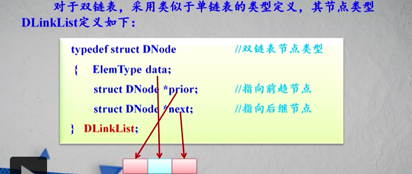

**双链表结点的插入和删除**

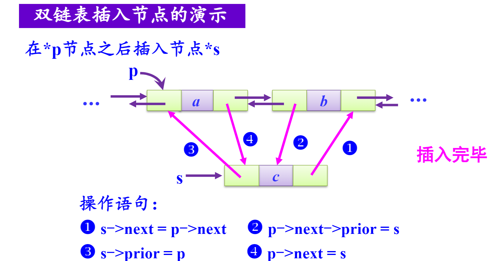

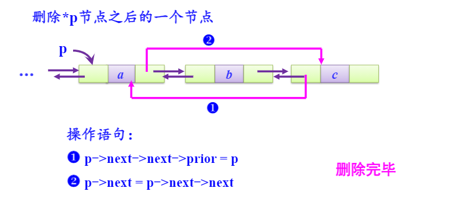

创建双链表

1. 头插法

   ```c
   void CreateList(DLinkList *&L,ElemType a[],int n){
       DLinkList *s;
       int i;
       L=(DLinkList *)malloc(sizeof(DLinkList));
       for(i=0;i<n;i++){
           s=(DLinkList *)malloc(sizeof(DLinkList));
   		s->data=a[i];
           s->next=L->next;
           if(L->next!=NULL){
               L->next->prior=s;
           }
           L->next=s;
           s->prior=L;
       }
   }
   ```

2. 尾插法

   ```c
   void CreateList(DLinkList *&L,ElemType a[],int n){
       DLinkList *s,*r;
       int i;
       L=(DLinkList *)malloc(sizeof(DLinkList));
       r=L;
       for(i=0;i<n;i++){
           s=(DLinkList *)malloc(sizeof(DLinkList));
   		s->data=a[i];
           r->next=s;
           s->prior=r;
           r=s;
       }
       r->next=NULL;
   }
   ```

**基本运算**

1. 双链表的插入

   ```c
   bool insertList(DlinkList *&L,int i,ElemType e){
       int j=0;
       DLinkList *p=L,*s;
       while(j<i-1 && p!=NULL){
           j++;
           p=p->next;
       }
       if(p==NULL){
           return false;
       }
       else{
           s=(DLinkList *)malloc(sizeof(DLinkList));
   		s->data=r;
           s->next=p->next;
           if(p->next!=NULL){
               p->next->piror=s;
           }
           s->prior=p;
           p->next=s;
           return true;
       }
   }
   ```

   

2. 双链表的删除

   ```c
   bool DelList(DlinkList *&L,int i,ElemType &e){
       int j=0;
       DLinkList *p=L,*q;
       while(j<i-1 && p!=NULL){
           j++;
           p=p->next;
       }
       if(p==NULL){
           return false;
       }
       else{
           q=p->next;
           if(q==NULL)
               return false;//不存在第i个结点
           e=q->data;
           p->next=q->next;
           if(p->next!=NULL)
               p->next->prior=p;
           free(p);
           return true;
       }
   }
   ```

3. 双链表逆序（头插法）

   ```c
   void Reverse(DLinkList *&L){
       DLinkList *p=L,*q;
       L->nexr=NULL;
       while(p!=NULL){
           q=p->next;
           p->next=L->next;
           if(L->next!=NULL){
               L->next->prior=p;
           }
           L->next=p;
           p->piror=L;
           p=q;
       }
   }
   ```

   

**链表操作都需要一个指向链表结点p指针来遍历结点，后插法创建需要一个r指针指向最后一个结点，删除一个节点和头插法逆序链表时需要q指针来保存p->next的结点（因为p->next会被赋值）**

### 循环链表

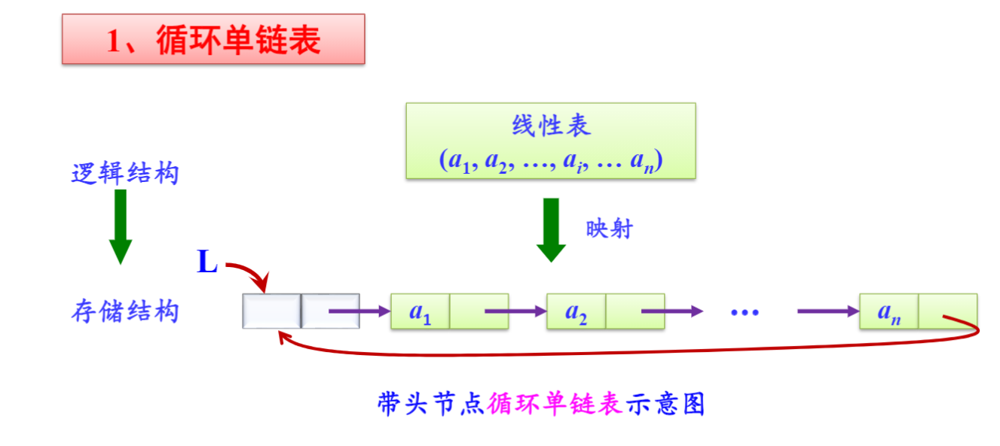

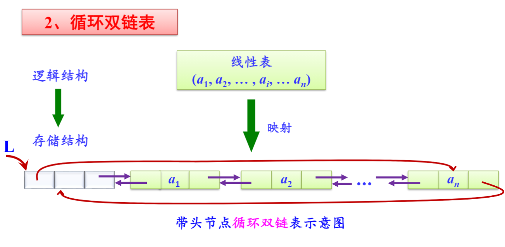

**循环链表对于频繁操作头尾的程序会提高执行效率**

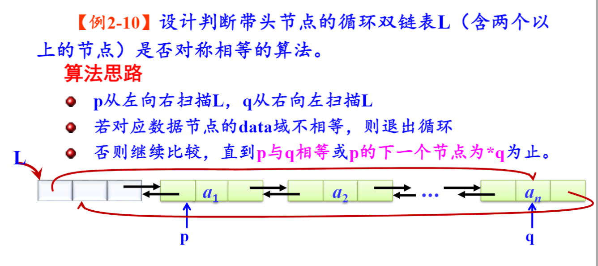

### 两张表自然连接问题

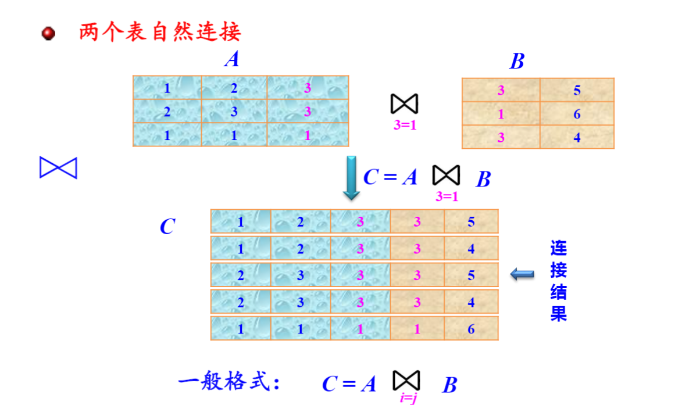

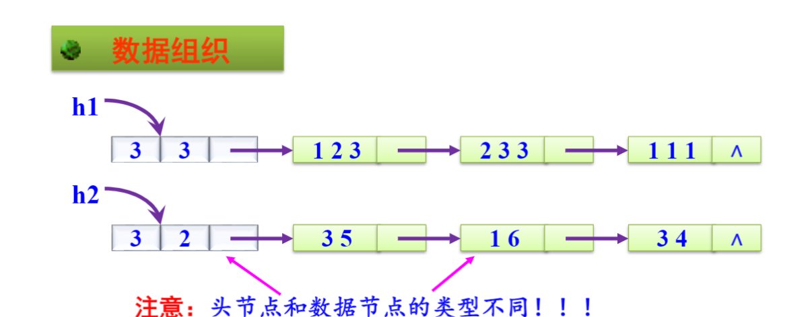

数据结点定义

```c
#define MaxCol 10
typedef struct Node1{
    ElemType data[MaxCol];
    struct Node1 *next;
}DList;
```

头结点定义

```c
typedef struct Node2{
    int Row,Col;
    DList *next;
}HList;
```

