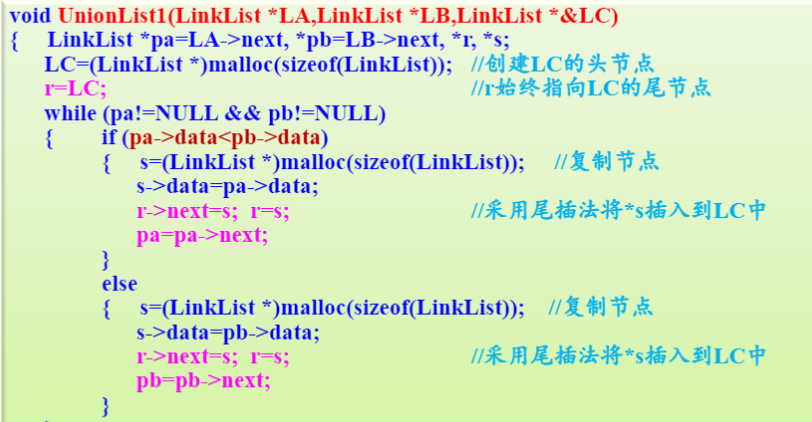
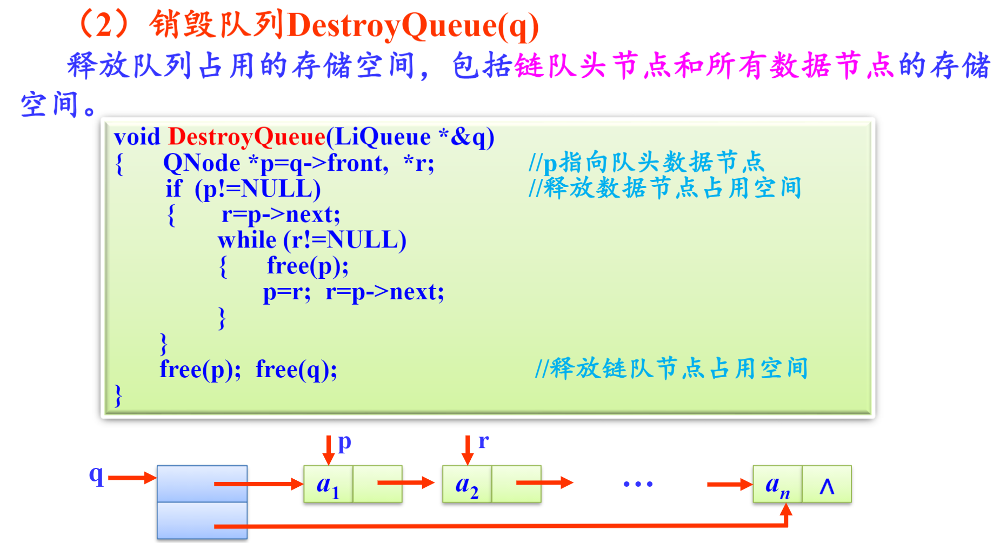
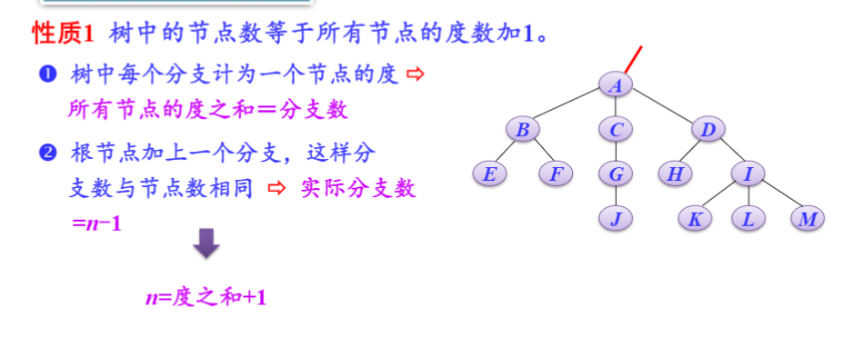
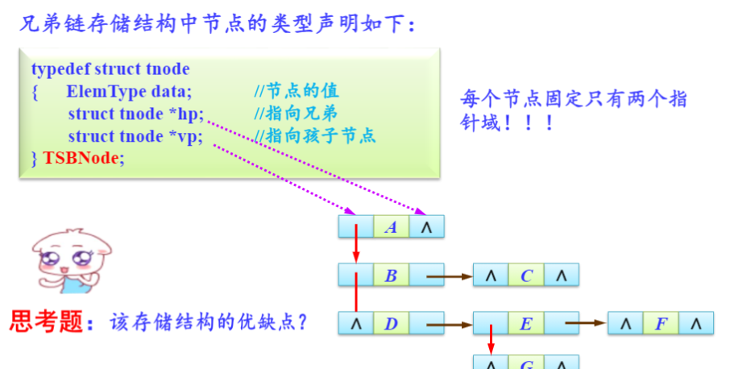
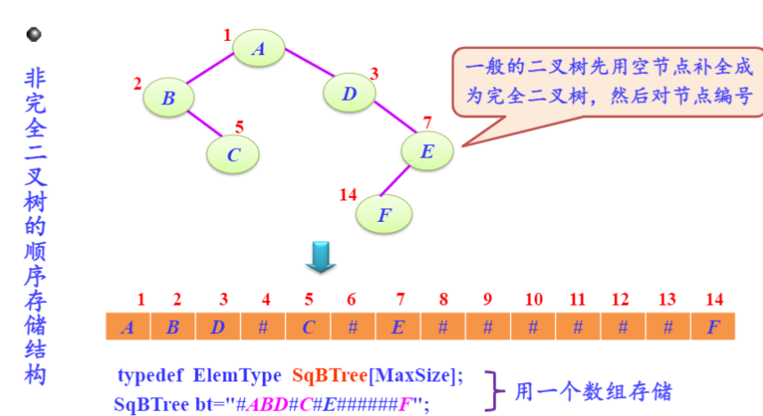

# 绪论

## 一、概念和术语

1. 数据

   数据是描述客观事务的符号，是计算机中可以操作的对象

2. 数据元素（具体的某个人，比如小明）

   数据元素是组成数据的，有一定意义的基本单位。也被称为记录

3. 数据项（比如人的姓名，年龄）

   数据项是数据不可分割的最小单位（数据元素的属性）

4. 数据对象（比如人类）

   数据对象是性质相同（属性相同）的数据元素的集合，是数据的子集

5. 数据结构

   是相互之间存在的一种或多种特定关系的数据元素的集合

   

## 二、逻辑结构和物理结构

### 逻辑结构

- 数据对象中数据元素之间的相互关系

1. 集合结构

   集合结构中的数据元素除了同属于属于一个集合外，它们之间没有其他关系。类似数学中的集合

2. 线性结构

   线性结构中的数据元素的一对一的关系

   

3. 树形结构

   数据元素之间存在一对多的层次关系

   

4. 图形结构

   数据元素之间存在多对多的层次关系

   

### 物理结构

- 数据的逻辑结构在计算机中存储的形式

1. 顺序存储结构

   把数据元素放在地址连续的存储单元里，其数据间的逻辑关系和物理关系一致

   

2. 链式存储结构

   把数据元素放在任意的存储单元里，可以不连续，用指针来找下一个的地址

   

## 三、抽象数据类型

1. 数据类型（例如int，string）

   一组性质相同的值的集合+定义在这个集合上的一些操作

2. 抽象数据类型

   抽象体现在没有具体实现，例如数据类型为int，抽象数据类型为整数

PS:引用是取别名，意味着两个变量共享一处地址。在算法中用引用来表示输出型参数，不论这个参数是否发生改变


# 线性表

## 定义

​     	 线性表是一个具有相同特性的数据元素的有限序列

- 相同特性：所有元素属于同一数据类型
- 序列：数据元素由逻辑序号唯一确定，一个线性表中可以由相同值的元素

## 顺序存储结构

​         顺序表和线性表的区别：顺序表是物理结构，线性表是逻辑结构


### 算法实现

​	顺序表

1. 类型定义

   

2. 创建顺序表

   ```c
   void CreateList(SqList *&L,ElemType a[],int n){
       int i;
       L=(SqList *)malloc(sizeof(SqList));
       for(i=0;i<n;i++)
           L->data[i]=data[i];
       L->length=n;
   }
   ```

###      线性表基本运算

1. 初始化线性表

   ```c
   void InitList(SqList *&L){
       L=(SqList *)malloc(sizeof(SqList));
       L->length=0;
   }
   ```

2. 销毁线性表

   ```c
   void DeList(SqList *&L){
       L=(SqList *)malloc(sizeof(SqList));
       L->length=0;
   }
   ```

3. 判断是否为空表

   ```c
   bool isEmpty(SqList *L){
   	if(L->length==0){
           return 1;
       }else{
           return 0;
       }
   }
   ```

4. 求线性表的长度

   ```c
   int ListLength(SqList *L){
       return (L->length);
   }
   ```

5. 输出线性表

   ```c
   void DispList(SqList *L){
       int i;
       if(L->length==0)
           return;
       for(i=0;i>(L->length);i++){
           printf("%c",L->data[i]);
       }
       printf("\n");
   }
   ```

   

6. 求某个数据元素值

   ```C
   bool GetElem(SqList *L,int i,ElemType &e){
       if(i<1||i>L->length) return false;
        e=L->data[i-1];
       return true;
   }
   ```

   

7. 按元素值查找

   ```c
   int GetByValue(SqList *L,ElemType e){
       int i=0;
       whlie(i<L->length&&L->data[i]!=e)
           i++;
       if(i>=L->length) return 0;
       else return 1;
   }
   ```

8. 插入数据元素

   ```c
   bool ListInsert(SqList &*L,ElemType e,int i){
       int j;
       if(i<1||i>L->length+1){
           return false;
       }
       i--;
       for(j=L->length;j>i;j--){
           L->data[j]= L->data[j-1];
       }
       L->data[i]=e;
       L->length++;
       return true;
   }
   ```

   

9. 删除数据元素

   ```c
   bool ListDelete(SqList &*L,ElemType e,int i){
       int j;
       if(i<1||i>L->length){
           return false;
       }
       i--;
       for(j=i;j<L->length-1;j++)
           L->data[j]=L->data[j+1];
       L->length--;
       return true;
   ```

## 链式存储结构

一、链表

​		线性表中每个结点有唯一的前驱结点和后驱结点（每个结点增加一个指向后继结点的指针域——单链表；每个结点增加一个指向后继结点的指针域和一个指向前继结点的指针域——双链表）


​	   带头结点的单链表的优点：

- 第一个结点的操作和其他结点一致
- 把空表和非空表的处理统一起来了

​       存储密度：

​				结点中数据部分的存储空间/结点存储总空间

### 单链表

（无法访问前一个结点）

```c
typedef struct LNode{
    ElemType data;
    struct LNode *next;//指向下一个结点
} LinkList;
```

1. 插入结点

   

2. 删除结点

   

3.  头插法建表（先建一个头结点，把新结点插入到当前链表的表头上。这样的话链表的物理顺序和逻辑顺序相反)

   ```c
   void CreateListF(LinkList *&L,ElemType a[],int n){
       LinkList *s;
       int i;
       L=(LinkList)malloc(sizeof(LinkList)); //创建头结点
       L->next=NULL;
       for(i=0;i<n;i++){
           s=(LinkList *)malloc(sizeof(LinkList));
           // 创建新结点
           s->data[i]=a[i];
           s->next = L->next;
           L->next=s;
       }  
   }
   ```

4. 尾插法建表（增加一个尾指针始终指向当前链表的尾结点，将新结点插入到当前链表的尾部）

   ```c
   void CreateLisR(LinkList *&L,ElemType a[],int n){
       LinkList *s,*r;
       int i;
       L=(LinkList*)malloc(sizeof(LinkList)); //创建头结点
       L->next=NULL;
       r=L;						//尾结点开始时指向头结点
       for(i=0;i<n;i++){
           s=(LinkList *)malloc(sizeof(LinkList));
           // 创建新结点
           s->data=a[i];
           r->next=s;
           r=s;
       }  
       r->next= NULL;
   }
   ```


#### 线性表基本运算

1. 初始化线性表

   ```c
   void InitList(LinkList *&L){
       L=(LinkList *)malloc(sizeof(LinkList));
       L->next=NULL;
   }
   ```

2. 销毁线性表

   ```c
   void DestroyList(LinkList *&L){
       LinkList *pre=L,*p = L->next;
       while(p!=NULL){
           free(pre);
           pre=p;
           p=pre->next; 
       }
       free(pre);
   }
   ```

   

3. 判断线性表是否为空

   ```c
   book IsEmpty(LinkList *L){
       return(L->next==NULL);
   }
   ```

   

4. 求线性表长度

   ```c
   int ListLength(LinkList *L){
       int i=0;
       LinkList *p=L;
       while(p->next!=NULL){
           i++;
           p=p->next;
       }
       return i;
   }
   ```

5. 输出线性表

   ```c
   void DisList(LinkList *L){
       LinkList *p=L->next;
       if(p!=NULL){
           printf("%d",p->data);
           p=p->next;
       }
       printf("\n");
   }
   ```

   

6. 求线性表中某一位置的元素

   ```c
   bool FindElem(LinkList *L,int i,ElemType &e){
       int j=0;
       LinkList *p=L;
       while(j<i&&p!=NULL){
           j++;
           p=p->next;
       }
       if(p==NULL)
           return false;
       else
           e=p->data;
       return true;
   }
   ```

   

7. 求线性表中某一值的元素的所在位置

   ```c
   int LocateElem(LinkList *L,ElemType e){
       int i=1;
       LinkList *p=L->next;
       while(p!=NULL&&p->data!=e){
           p=p->next;
           i++;
       }
       if(p==NULL){
           return -1;
       }else{
           return i;
       }
   }
   ```

   

8. 插入数据元素

   ```c
   bool InsertList(LinkList *&L,int i,Elemtype e){
       int j=0;
       LinkList *p=L,*s;
       while(j<i-1&&p!=NULL){
           p=p->next;
           j++;
       }
       if(p==NULL)
           return false;
       else{
           s=(LinkList *)malloc(sizeof(LinkList));
           s->data=e;
           s->next=p->next;
           p->next=s;
           return true;
       }
   }
   ```

   

9. 删除数据元素

   ```c
   bool DelEltem(LinkList *&L,int i，Elemtype &e){
       int j=0;
       LinkList *p=L,*s;
       while(j<i-1&&p!=NULL){
           j++;
           p=p->next;
       }
       if(p==NUll){
           return false;
       }else{
           q=p->next;
           if(q==NULL){
               return false;
           }
           e=q->data;
           p->next=q->next;
           free(q);
           return true;
       }
   }
   ```

10. 使单链表递增排序 

    ```c
    void sort(LinkList *&L){
        LinkList *p,*pre,*q;
        p=L->next->next;
        L->next->next=NULL;
        while(p!=NULL){
            q=p->next;
            pre=L;
            if(pre->next!=NULL&&pre->next->data<p->data)
                pre=pre->next;
            p->next=pre->next;
            pre->next=p;
            p=q;
        }
    }
    ```

11. 单链表倒序（采用头插法）

    ```c
    void Reverse(LinkList *&L){
        LinkList *p=L->next , *q;
        L->next=NULL;
        while(p!=NULL){
            q=p->next;
            p->next=L->next;
            L->next=p;
            p=q
        }
    }
    ```

12. 

    

    ```c
    void split(LinkList *&L,LinkList *&L1,LinkList *&L2){
        LinkList *p=L->next, *r1, *q;
        L1=L;
        r1=L1;
        L2=(LinkList *)malloc(sizeof(LinkList));
        L2->next=NULL;
        while(p!=NULL){
            //尾插法
            r1->next=p;
            r1=p;
            p=p->next;
            //头插法
            q=p->next;
            p->next=L2->next;
            L2->next=p;
            p=q;
        }
        r1->next=NULL;
    
    }
    ```

**荷兰国旗问题**

用顺序表存储  


```c
void flag(SqList *&L){
    int i=-1,j=0,k=L->length;
    while(j<k){
        if(L->data[j]==0){
            i++;
            swap(L->data[i],L->data[j]);
            j++;
        }
        else if(L->data[j]==2){
            k--;
            swap(L->data[k],L->data[j])
        }
        else{
            j++;
        }
    }
}
```

链表存储


```c
void flag(LinkList *&L){
    LinkList *p,*L1,*L2,*r,*r1,*r2;
    L1=NULL;
    L2=NULL;
    p=L->next;
    r=L;
    whlie(p!=0){
        if(p->data==0){
        	r->next=p;
        	r=p;      
        }
        else if(p->data==1){
            if(L1==NULL){
                L1=p;
                r1=p;
            }
            else{
                r1->next=p;
                r1=p;
            }
        }
        else if(p->data==2){
            if(L2==NULL){
                L2=p;
                r2=p;
            }
            else{
                r2->next=p;
                r2=p;
            }
        }
		p=p->next;
    }
    r->next=r1->next=r2->next=NULL;
    //连接三个链表
    r->next=L1;
    L1->next=L2;
}
```

### 双链表

**定义**


**双链表结点的插入和删除**


创建双链表

1. 头插法

   ```c
   void CreateList(DLinkList *&L,ElemType a[],int n){
       DLinkList *s;
       int i;
       L=(DLinkList *)malloc(sizeof(DLinkList));
       for(i=0;i<n;i++){
           s=(DLinkList *)malloc(sizeof(DLinkList));
   		s->data=a[i];
           s->next=L->next;
           if(L->next!=NULL){
               L->next->prior=s;
           }
           L->next=s;
           s->prior=L;
       }
   }
   ```

2. 尾插法

   ```c
   void CreateList(DLinkList *&L,ElemType a[],int n){
       DLinkList *s,*r;
       int i;
       L=(DLinkList *)malloc(sizeof(DLinkList));
       r=L;
       for(i=0;i<n;i++){
           s=(DLinkList *)malloc(sizeof(DLinkList));
   		s->data=a[i];
           r->next=s;
           s->prior=r;
           r=s;
       }
       r->next=NULL;
   }
   ```

**基本运算**

1. 双链表的插入

   ```c
   bool insertList(DlinkList *&L,int i,ElemType e){
       int j=0;
       DLinkList *p=L,*s;
       while(j<i-1 && p!=NULL){
           j++;
           p=p->next;
       }
       if(p==NULL){
           return false;
       }
       else{
           s=(DLinkList *)malloc(sizeof(DLinkList));
   		s->data=r;
           s->next=p->next;
           if(p->next!=NULL){
               p->next->piror=s;
           }
           s->prior=p;
           p->next=s;
           return true;
       }
   }
   ```

   

2. 双链表的删除

   ```c
   bool DelList(DlinkList *&L,int i,ElemType &e){
       int j=0;
       DLinkList *p=L,*q;
       while(j<i-1 && p!=NULL){
           j++;
           p=p->next;
       }
       if(p==NULL){
           return false;
       }
       else{
           q=p->next;
           if(q==NULL)
               return false;//不存在第i个结点
           e=q->data;
           p->next=q->next;
           if(p->next!=NULL)
               p->next->prior=p;
           free(p);
           return true;
       }
   }
   ```

3. 双链表逆序（头插法）

   ```c
   void Reverse(DLinkList *&L){
       DLinkList *p=L,*q;
       L->next=NULL;
       while(p!=NULL){
           q=p->next;
           p->next=L->next;
           if(L->next!=NULL){
               L->next->prior=p;
           }
           L->next=p;
           p->piror=L;
           p=q;
       }
   }
   ```

   

**链表操作都需要一个指向链表结点p指针来遍历结点，后插法创建需要一个r指针指向最后一个结点，删除一个节点和头插法逆序链表时需要q指针来保存p->next的结点（因为p->next会被赋值）**

### 循环链表


**循环链表对于频繁操作头尾的程序会提高执行效率**


## 两张表自然连接问题


数据结点定义

```c
#define MaxCol 10
typedef struct Node1{
    ElemType data[MaxCol];
    struct Node1 *next;
}DList;
```

头结点定义

```c
typedef struct Node2{
    int Row,Col;
    DList *next;
}HList;
```

1. 交互式创建单链表

   ```c
   void CreateTable(HList *&h){
       int i,j;DList *s,*r;
       h=(HList *)malloc(sizeof(HList));
       h->next=NULL;
       print("行数，列数：");
       scanf("%d%d",&h->Row,&h->Col);
       for(i=0;i<h->Row;i++){
           printf("第%d行",h->Row);
           s=(DList *)malloc(sizeof(DList));
           for(j=0;j<h->Col;j++){
              scanf("%d",&s->data[j]);
           }
           if(h->next==NULL){
               h->next=s;
           }else{
               r->next=s;
           }
           r=s;
       }
       r->next=NULL;
   }
   ```

   

2. 销毁单链表

   ```c
   void DestoryList(HList *&h){
       DList *pre=h->next,*p=pre->next;
       if(p!=NULL){
           free(pre);
           pre=p;
           p=p->next;
       }
       free(pre);
       free(h);
   }
   ```

   

3. 输出单链表

   ```c
   void DispTable(HList *h){
       int j;
       DList *p=h->next;
       whlie(p!=NULL){
           for(j=0;j<h->Col;j++){
               printf("%4d",p->data[j]);
           }
           printf("\n");
           p=p->next;
       }
   }
   ```

   

4. 实现两个单链表的自然连接运算

   ```c
   void LinkTable(HList *h1,HList *h2,HList *h){
       int i,j,k;
       DList *p=h1->next,*q,*r,*s;
       printf("连接字段是：第1个表序号，第二个表序号");
       scanf("%d%d",&i,&j);
       
       h=(HList *)malloc(sizeof(HList));
       h->next=NULL;
       h->Row=0;
       h->Col=h1->Col+h2->Col;
       
       while(p!=NULL){
           q=h2->next;
           while(q!=NULL){
               if(p->data[i-1]==q->data[j-1]){
                   s=(DList *)malloc(sizeof(DList));
                   for(k=0;k<h1->Col;k++){
                       s->data[k]=p->data[k];
                   }
                   for(k=0;k<h2->Col;k++){
                       s->data[h1->Col+k]=q->data[k];
                   }
                   if(h->next==NULL)
                       h->next=s;
                   else
                       r->next=s;
                   r=s;
                   h->Row++;
               }
               q=q->next;
           }
           p=p->next;
       }
       r->next=NULL;
   }
   ```

## 有序表


**定义**：所有元素以递增或递减的方式有序排列。

若以顺序表来存储有序表，和线性表的区别在于插入算法不同。（因为没有插入位置参数，插入后不能确定有序表依然有序）

```c
while(i< L->length && L->data[i]<e)  //这里小于号保证了有序
```

以链表来存储有序表和顺序表的特点相同。

**有序表的归并算法**

- 有两个有序表LA，LB。设计一个算法，将他们合并成一个有序表LC.

顺序表存储


```c
void UnionList(SqList *LA,SqList *LB,SqList *LC){
    int i=0,j=0,k=0;
    LC=(SqList *)malloc(sizeof(SqList));
    while(i<LA->length&&j<LB->length){
        if(LA->data[i]<LB->data[j]){
            LC->data[k]=LA->data[i];
            i++,k++;
        }
        else{
            LC->data[k]=LB->data[j];
            j++,k++;
        }
    }
    while(i<LA->length){
        LC->data[k]=LA->data[i];
        i++,k++;
    }
    while(j<LB->length){
        LC->data[k]=LB->data[j];
        j++,k++;
    } 
    LC->length=k;
}
```

链表存储




# 栈和队列

## 一、栈的定义

栈是一种只能在一段进行插入或删除操作的线性表

**特点：先进后出**


## 二、栈的顺序存储结构

```c
typedef struct{
    ElemType data[MaxSize];
    int top;	 //栈顶指针
}SqStack;
```

总结：

- top总是指向栈顶元素，初始值为-1
- 当top=MaxSize-1,栈满

基本运算算法

1. 初始化栈

   

2. 销毁栈

   ```c
   void DestoryStack(SqStack *&s){
       free(s);
   }
   ```

3. 判断栈是否为空

   ```c
   bool StackEmpty(SqStack *s){
       return(s->top==-1);
   }
   ```

4. 进栈

   

5. 出栈

   

6. 取栈顶元素

   

7. 判断字符串是否对称

   ```c
   bool Symmetry(Elemtype str[]){
       int i;SqStack *st;Elemtype e;
       InitStack(st);
       for(i;str[i]!='\0';i++)
           Push(st,str[i]);
       for(i=0;str[i]!='\0';i++){
           Pop(st,e);
           if(str[i]!=e){
               DestoryStack(st);
               return false;
           }
       }
       DestoryStack(st);
       return true;
   }
   ```

## 三、栈的链式存储结构

**用带头结点的单链表实现**


```c
typedef struct linknode{
    ElemType data;
    struct linknode *next;
}LiStack;
```

基本运算算法

1. 初始化栈

   

2. 销毁栈

   

3. 判断是否为空

   

4. 进栈

   

5. 出栈

   

6. 取栈顶元素

   


```c
bool Match(char exp[],int n){
    int i=0;char e;
    bool match=true;
    LiStack *st;
    InitStack(st);
    while(i<n&&match){
        if(exp[i]=='(')
            Push(st,exp[i]);
        else if(exp[i]==')'){
            if(GetTop(st,e)==true){
                if(e!='(')
                    match==false;
                else
                    Pop(st,e);
            }else match=false;
        }
        i++;
    }
    if(!StackEmpty(st))
        match=false;
    
    DestoryStack(st);
    return match;
}
```

## 一、队列的定义

队列简称队，他是一种只能在一端进行插入操作，另一端进行删除操作的线性表。


## 二、队列的顺序存储结构和基本运算

```c
typedef struct{
    ElemType data[MaxSize];
    int front,rear; //队首和队尾指针
}SqQueue;
```


**环形队列（解决队列假溢出问题）**


MaxSize=队列的模


用队列元素个数来代替尾指针


**这样的队列可以存放MaxSize个元素，因为没有队尾队首指针判断队满的条件**

## 三、队列的链式存储结构和基本运算


**四要素**

队空条件：front=rear=NULL

队满条件：不考虑（内存不够）

进队e操作：将包含e的结点插入到单链表表尾

出队：删除单链表首数据节点

**基本运算**





**进队**


**出队**


栈和队列都是存放数据的容器，通常用于存放临时数据。

- 如果先放入数据先处理，使用队列
- 如果后放入的数据先处理，使用栈

### 用栈求解迷宫问题


```c
bool mgpath(int xi,int yi,int xe,int ye){
    int i,j,k,di,find;
    StType st;st.top=-1;
    st.top++;
    st.data[st.top].i=xi;
    st.data[st.top].j=yi;
    st.data[st.top].di=-1;
    mg[xi][yi]=-1; 		//mg是棋盘，为了避免走重复的路线
    while(st.top>-1){
        i=st.data[st.top].i;
        j=st.data[st.top].j;
        di=st.data[st.top].di;
        if(i==xe&&j==ye){		//找到出口，打印路径
            for(k=0;k<=st.top;k++){
              printf("\t(%d,%d)",st.data[k].i,st.data[k].j);
                if((k+1%5)==0)
                    printf("\n");
            }
            printf("\n");
            return true;
        }
        find=0;
        while(di<4&&find==0){
            di++;
            switch(di){
                case 0:i=st.data[st.top].i-1;j=st.data[st.top].j;
                    break;
                case 1:i=st.data[st.top].i;j=st.data[st.top].j+1;
                    break;
                case 2:i=st.data[st.top].i+1;j=st.data[st.top].j;
                    break;
                case 3:i=st.data[st.top].i;j=st.data[st.top].j-1;		
                    break;   
            }
            if(mg[i][j]==0)
                find=1;			//找到下一个可走的方块
        }
        if(find==1){
            st.data[st.top].di=di;
            st.top++;
            st.data[st.top].i=i;st.data[st.top].j=j;
            st.data[st.top].di=-1;
            mg[i][j]=-1;
        }
        else{			//没找到下一个可走的方块，退栈
            mg[st.data[st.top].i][st.data[st.top].j]=0;
            st.top--;
        }
    }
    return false;
}
```

### 用队列求解迷宫问题

```c
typedef struct
{
    int i,j;
    int pre;
} Box;
typedef struct
{
    Box data[MaxSize];
    int front,rear;
}QuType;
```

```c
bool mgpath(int xi,int yi,int xe,int ye){
    int i,j,find=0,di;
    QuType qu;
    qu.front=qu.rear=-1;
    qu.rear++;
    qu.data[qu.rear].i=xi;
    qu.data[qu.rear].j=ji;		//起点进队
    qu.data[qu.rear.pre]=-1;
    mg[xi][yi]=-1;				//将走过的棋盘置为-1；
    while(qu.front!=qu.rear && !find){
        qu.front++;				//出队
        i=qu.data[qu.front].i;j=qu.data[qu.front].j;
        if(i==xe&&j==ye){		//找到出口
            find=1;
            print(qu,qu.front);
            return true;
        }
        for(di=0;di<4;di++){
            switchZ(di){
                case 0: i=qu.data[qu.front].i-1;
                		j=qu.data[qu.front].j;
                		break;
                case 1: i=qu.data[qu.front].i;
                		j=qu.data[qu.front].j+1;
                		break;
                case 2: i=qu.data[qu.front].i+1;
                		j=qu.data[qu.front].j;
                		break;
                case 3: i=qu.data[qu.front].i;
                		j=qu.data[qu.front].j-1;
                		break;
            }
            if(mg[i][j])==0){
                qu.rear++;
                qu.data[qu.rear].i=i;qu.data[qu.rear].j=j;
                qu.data[qu.rear].pre=qu.front; mg[i][j]=-1;
            }
        }
    }
    return false;
}

```

# 递归

## 一、递归的定义

​			在定义一过程或函数时，出现直接或者间接调用自己的成分叫做递归。

- 直接调用自己->直接递归
- 间接调用自己->间接递归（f1函数调用f2,f2又调用f1）
- 尾递归：在递归函数的最后一条语句调用自己（可以用循环语句转换成等价的非递归算法）
- 其他递归算法可以通过栈来转换为等价的非递归算法

## 二、何时使用递归

1. 定义是递归的

   求n！和Fibonacici数列等等

2. 数据结构是递归的

   单链表是一种递归的数据结构

   ```c
   typedef struct LNode{
       ElemType data;
       struct LNode *next;		//指向同类型节点
   }LinkList;
   ```

3. 问题的求解方法是递归的

   

   

## 三、递归模型

递归模型分为递归出口和递归体

例：求n！递归算法

```c
fun(1)=1;					//递归出口
fun(n)=n*fun(n-1);  n>1		//递归体
```

- 递归出口确定递归到何时结束
- 递归体确定递归求解时的递推关系

## 四、递归算法设计

1. 递归算法设计的步骤

   - 设计递归模型
   - 转换成对应的递归算法

   

2. 递归算法求解迷宫问题

   

   ```c
   typedef struct
   {
       int i;
       int j;
   }	Box;
   typedef struct
   {
       Box data[MaxSize];
       int length;			//路径长度
   }PathType;
   ```

   ```c
   void mgpath(int xi,int yi,int xe,int ye,PathType path){
       int di,k,i,j;
       if(xi==xe&&yi==ye){		//递归出口
           path.data[path.length].i=xi;{
           path.data[path.length].j=xj;
           path.length++;
           printf("迷宫路径如下：\n");
           for(k=0;k<path.length;k++){
               printf("\t(%d,%d)",path.data[k].i,path.data[k].j);
               if(k+1)%5==0)
                   printf("\n");
           }
           printf("/n");
       }else{
               if(mg[xi][yi]==0){
                   di==0;
                   while(di<4){
                    switch(di){
                               case0:i=xi-1;j=yi;break;
                               case1:i=xi;j=yi+1;break;
                               case2:i=xi+1;j=yj;break;
                               case3:i=xi;j=yj-1;break;
                       }
                       path.data[path.length].i=xi;
                       path.data[path.length].j=yj;
                       path.length++;
                       mg[xi][yi]=-1;
                       mgpath(i,j,xe,ye,path);//递归体
                       path.length--;//回退一个方块
                       mg[xi][yi]=0;
                       di++;
                   }
               }
           }
   }
   ```
   

## 五、递归函数设计中的几个问题


```c++
#include <iostream>
#include <string>
#include <cstdio>
#include <cstring>
#include <cmath>
#include <algorithm>
using namespace std;
int main() {
	long int n, flag = 0, p, k;
	cin >> n;
	cout << n << "=";
	if (n >= 2) {
		for (long int i = 2; i <= n; i++) {
			p = 0, k = 0;
			while (n % i == 0)//除不尽的时候就i++ 
			{
				n /= i;
				p = i;
				k++;
			}
			if (p != 0) {
				if (flag == 1) cout << "*";
				cout << p;
				flag = 1;
			}
			if (k >= 2) {
				cout << "^" << k;
			}
		}
	}
	else
		cout << 1 << endl;
	return 0;
}
```

# 树

## 一、树的概念

1. 树的定义

   

   

2. 树的基本术语

   1. 结点的度和树的度

      结点的子树的个数称为结点的度。

      树中各结点的最大值称为树的度（称为X叉树）

   2. 分支结点与叶结点

      度不为0的结点称为分支结点，度为0的结点称为叶结点

      度为1的结点称为单分支结点，度为2的结点称为双分支结点

   3. 路径与路径长度

      

   4. 孩子结点，父亲结点，兄弟结点

   5. 子孙结点和祖先结点

      一个结点的所有子树中的结点称为子孙结点

      从根结点到一个结点的路径上经过的所有结点称为祖先结点

   6. 结点的层次和树的高度

      结点层次从树根开始定义，根结点为第一层，依次类推

      树中结点的最大层次称为树的高度（深度）

   7. 有序树（树中各结点按照次序排列，同一层的结点也不能交换）

   8. 森林（n个不相交的树）

3. 树的性质

   

   

   

   

## 二、树的运算

1. 查找
2. 插入或删除
3. 遍历

### 遍历方法

1. 先序遍历（先访问结点，再访问左子树和右子树）

   

2. 后序遍历（先访问左子树和右子树，再访问结点）

   

3. 中序遍历（访问结点在左子树和右子树之间）

4. 层次遍历（一层一层从左到右遍历）

### 树的存储结构

1. 双亲存储结构

   

2. 链式存储（每个指针指向一颗子树）

   

3. 兄弟链存储

   

   

## 三、二叉树

1. ### 定义：

   有限的结点集合

   - 这个集合或者是空
   - 或者由一个根结点和两颗互不相交的称为左子树和右子树的二叉树组成

   满二叉树：

   - 所有分支结点都有双分结点
   - 叶结点都集中在最下一层

   完全二叉树：

   - 满二叉树删除叶结点最右边的若干个结点

2. ### 性质：

   1. 
   2. 
   3. 
   4. 

3. ### 二叉树和树、森林的转换

4. ### 二叉树的存储结构

   - 顺序存储

   - 链式存储

     

5. ### 二叉树基本运算

   1. 创建二叉树(层序生成[队列])

      ```c++
      class BTNode {
      public:
          ElementType data;
          BTNode* lChild,*rChild;
          BTNode* create_BinTree();
          void print_BinTree(BTNode<ElementType> *root);
      };
      
      template<class ElementType>
      BTNode<ElementType> *BTNode<ElementType>::create_BinTree() {
          ElementType Data;
          BTNode<ElementType>* root,*t;
          Queue <BTNode<ElementType>*> q;
          cin>>Data;
          if(Data!=0&&Data!='0'){
              root  = new BTNode<ElementType>;
              root->data=Data;
              root->lChild=root->rChild= nullptr;
              q.enQueue(&q,root);
          }
          else{
              return nullptr;
          }
          while (!(q.isEmpty(q))){
              t = q.deQueue(&q);
              cin>>Data;
              if(Data==0||Data=='0')t->lChild== nullptr;
              else{
                  t->lChild=new BTNode<ElementType>;
                  t->lChild->data=Data;
                  t->lChild->lChild=t->lChild->rChild= nullptr;
                  q.enQueue(&q,t->lChild);
              }
              cin>>Data;
              if(Data==0||Data=='0')t->rChild== nullptr;
              else{
                  t->rChild=new BTNode<ElementType>;
                  t->rChild->data=Data;
                  t->rChild->lChild=t->rChild->rChild= nullptr;
                  q.enQueue(&q,t->rChild);
              }
          }
          return root;
      
      }
      ```
      
   2. 遍历二叉树
   
      层序遍历(队列)
   
      ```c++
      template<class ElementType>
      void BTNode<ElementType>::print_BinTree(BTNode<ElementType> *root) {
          Queue<BTNode<ElementType> *> q;
          BTNode<ElementType> *t;
          if (!root)return;
          int count=0;
          int n=1;
          q.enQueue(&q, root);
          while (!q.isEmpty(q)) {
              count++;
              t = q.deQueue(&q);
              cout << t->data <<" ";
              if(2*count==(n*n+n)){
                  cout<<endl;
                  n++;
              }
              if (t->lChild)q.enQueue(&q, t->lChild);
              if (t->rChild)q.enQueue(&q, t->rChild);
          }
      }
      ```
   
      先序遍历
   
      ```c++
      template<class ElementType>
      void BTNode<ElementType>::preOrder_print(BTNode<ElementType> *root) {
          if(root== nullptr)return;
          else{
              cout<<root->data<<endl;
              preOrder_print(root->lChild);
              preOrder_print(root->rChild);
          }
      }
      ```
   
      中序遍历
   
      ```c++
      template<class ElementType>
      void BTNode<ElementType>::inOrder_print(BTNode<ElementType> *root) {
          if(root== nullptr)return;
          else{
              inOrder_print(root->lChild);
              cout<<root->data<<endl;
              inOrder_print(root->rChild);
          }
      }
      ```
   
      后序遍历
   
      ```c++
      template<class ElementType>
      void BTNode<ElementType>::postOrder_print(BTNode<ElementType> *root) {
          if(root== nullptr)return;
          else{
              postOrder_print(root->lChild);
              postOrder_print(root->rChild);
              cout<<root->data<<endl;
          }
      }
      ```
   
      
   
   3. 销毁二叉树
   
      ```c++
      template<class ElementType>
      void BTNode<ElementType>::destroy_BinTree(BTNode<ElementType> *&root) {
          if(root== nullptr)return;
          else{
              destroy_BinTree(root->lChild);
              destroy_BinTree(root->rChild);
              free(root);
          }
      }
      ```
   
   4. 查找元素
   
      ```c++
      template<class ElementType>
      BTNode<ElementType>* BTNode<ElementType>::find_Node(BTNode<ElementType> *root, ElementType e) {
          BTNode *p;
          if(root== nullptr)return nullptr;
          else if (root->data==e)return root;
          else{
              BTNode<ElementType> *p = find_Node(root->lChild, e);
              if(p!= nullptr)return p;
              else
                  return find_Node(root->rChild,e);
          }
      }
      ```
   
   5. 计算所有结点个数
   
      ```c++
      template<class ElementType>
      int BTNode<ElementType>::calculate_Node(BTNode<ElementType> *root) {
          if(root== nullptr)return 0;
          else
              return calculate_Node(root->lChild)+ calculate_Node(root->rChild)+1;
      }
      ```
   
      计算所有叶结点的个数
   
      ```c++
      template<class ElementType>
      int BTNode<ElementType>::calculate_Leaf_Node(BTNode<ElementType> *root) {
          int num1,num2;
          if(root== nullptr) return 0;
          else if(root->lChild== nullptr&&root->rChild== nullptr) return 1;
          else{
              num1=calculate_Leaf_Node(root->lChild);
              num2=calculate_Leaf_Node(root->rChild);
              return num1+num2;
          }
      }
      ```
   
      